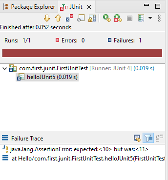

#  Testing and it's Types
It is a process of ensuring that the functionality of an application  meets the requirements.

Different Types of testing are -:

1. Unit testing:

Unit testing is a process in which the smallest independent module is tested to check whether its working properly or not.
unit testing can be done manually but is often automated.

2. Integration tests

Integration tests verify that different modules or services used by your application work well together. For example, it can be testing the interaction with the
database or making sure that microservices work together as expected. These types of tests are more expensive to run as they require multiple parts of the 
application to be up and running.

3. Functional Test

Functional tests focus on the business requirements of an application. They only verify the output of an action and do not check the intermediate states of the 
system when performing that action.
There is sometimes a confusion between integration tests and functional tests as they both require multiple components to interact with each other. The difference is 
that an integration test may simply verify that you can query the database while a functional test would expect to get a specific value from the database as defined 
by the product requirements.

4. End to ends Tests

End-to-end testing replicates a user behavior with the software in a complete application environment. It verifies that various user flows work as expected and can be
as simple as loading a web page or logging in or much more complex scenarios verifying email notifications, online payments, etc...
End-to-end tests are very useful, but they're expensive to perform and can be hard to maintain when they're automated. It is recommended to have a few key end-to-end 
tests and rely more on lower level types of testing (unit and integration tests) to be able to quickly identify breaking changes.

5. Acceptance Testing

Acceptance tests are formal tests that verify if a system satisfies business requirements. They require the entire application to be running while testing and focus 
on replicating user behaviors. But they can also go further and measure the performance of the system and reject changes if certain goals are not met.

6. Performance Testing

Performance tests evaluate how a system performs under a particular workload. These tests help to measure the reliability, speed, scalability, and responsiveness of 
an application. For instance, a performance test can observe response times when executing a high number of requests, or determine how a system behaves with a 
significant amount of data. It can determine if an application meets performance requirements, locate bottlenecks, measure stability during peak traffic, and more. 

7. Smoke Testing

Smoke tests are basic tests that check the basic functionality of an application. They are meant to be quick to execute, and their goal is to give you the assurance 
that the major features of your system are working as expected.
Smoke tests can be useful right after a new build is made to decide whether or not you can run more expensive tests, or right after a deployment to make sure that 
they application is running properly in the newly deployed environment.


# Unit-testing
Unit testing is a process in which the smallest independent module is tested to check whether its working properly or not.
unit testing can be done manually but is often automated.


## Difference Between Manual Testing and Automation Testing
|Manual Testing                           |  Automation Testing                          |
| :-----                                  |  :------
|Executing a test cases manually          |  Taking tool support and executing the test  |
|Time consuming                           |  Fast                                        |
|Huge investment in human resources       |  Less Investment of human resources.         |
|Non programmable                         |  programmable                                |

## Unit Testing Tools:

There are several automated unit test software available to assist with unit testing. We will provide a few 

examples below:

1. Junit: Junit is a free to use testing tool used for Java programming language.  It provides assertions to 

   identify test method. This tool test data first and then inserted in the piece of code.

2. NUnit:  NUnit is widely used unit-testing framework use for all .net languages.  It is an open source tool 

   which allows writing scripts manually. It supports data-driven tests which can run in parallel.

3. JMockit:  JMockit is open source Unit testing tool.  It is a code coverage tool with line and path 

   metrics. It allows mocking API with recording and verification syntax. This tool offers Line coverage, 
   
   Path Coverage, and Data Coverage.

4. EMMA:  EMMA is an open-source toolkit for analyzing and reporting code written in Java language. Emma 

   support coverage types like method, line, basic block. 

   It is Java-based so it is without external library dependencies and can access the source code.

5. PHPUnit: PHPUnit is a unit testing tool for PHP programmer. It takes small portions of code which is       

called units and test each of them separately.  

The tool also allows developers to use pre-define assertion methods to assert that a system behave in a 

certain manner. 

Notes: truth is Unit testing increase the speed of development.

## Unit Testing advantage and Disadvantage
Unit Testing Advantage:

1. Developers looking to learn what functionality is provided by a unit and how to use it can look at the 

unit tests to gain a basic understanding of the unit API.

2. Unit testing allows the programmer to refactor code at a later date, and make sure the module still works 

correctly (i.e. Regression testing). The procedure is to write test cases for all functions and methods so 

that whenever a change causes a fault, it can be quickly identified and fixed.

3. Due to the modular nature of the unit testing, we can test parts of the project without waiting for others 

to be completed.

<!--style="font-size:30px"-->
Unit Testing Disadvantages:

1. Unit testing can’t be expected to catch every error in a program. It is not possible to evaluate all 

execution paths even in the most trivial programs.

2. Unit testing by its very nature focuses on a unit of code. Hence it can’t catch integration errors or 

broad system level errors.

3. It’s recommended unit testing be used in conjunction with other testing activities.

# Junit and it's Feature

* Junit is a Unit testing framework for java programming.

* Follows the test a little, code a little approach.

* Increase productivity of a programmer and stability of code.

<!--style="font-size:30px"-->
Features of Junit

1. an open source framework.

2. Annotation to identify test methods.

3. Assertions for testing expected results.

4. allow you to write codes faster ,which increase quality.

5. simple to use.

6. Runs automatically.check their own results and prvide immediate feedback no need to manually comb through 

   a report of test results.

7. can be organised into test suites.

8. progress bar facility.

## What is unit test case?

* A Unit Test Case is a part of code, which ensures that another part of code (method) works as expected. To 

  achieve the desired results quickly, a test framework is required. JUnit is a perfect unit test framework 
  
  for Java programming language.

* A formal written unit test case is characterized by a known input and an expected output, which is worked 

  out before the test is executed. The known input should test a precondition and the expected output should 
  
  test a post-condition.

* There must be at least two unit test cases for each requirement − one positive test and one negative test. 

  If a requirement has sub-requirements, each sub-requirement must have at least two test cases as positive 
  
  and negative.

<!--style="font-size:20px"-->
characterizations of unit test cases are:

* Known input

* Expected result/output.

* precondition

* post condition

Notes:At least two test case for each requirement(positive and negative).


# Learn Junit 5

* JUnit 5 is a opensource and next generation of JUnit for Java 8 and greater versions. In our JUnit 5 

tutorials we have covered most of the examples for writing tests. JUnit 5 requires Java 8 or higher at 

runtime.

* Unlike previous versions of JUnit, and JUnit 5 is composed of several different modules from three 

  different sub-projects. In this Junit 5 tutorial we have focused on Junit Jupiter for writing tests and 
  
  Junit platform for executing tests.

* JUnit 5 = JUnit Platform + JUnit Jupiter + JUnit Vintage

* Junit Platform : It is a Launcher for test frameworks on JVM, defines TestEngine API for discovering and 

  executing tests, provides ConsoleLauncher for running Junit vintage and Junit Jupiter tests, and first 
  
  class support for IDEs and build tools like Gradle, Maven etc.

* Junit Jupiter : A new programming model for writing unit tests, an extension model for Junit 4 and provides 

  standard assertions.

* Junit Vintage : A TestEngine to run JUnit 3 & JUnit 4 tests and migration support to JUnit 5 (JUnit 

  Jupiter).


## Difference Between Junit 4 and Junit 5


## Learn How to write unit test by using Junit 5

This tutorial explains unit testing with JUnit with the JUnit 5 framework (JUnit Jupiter). It explains the 

creation of JUnit 5 tests with the Maven and Gradle build system.

It demonstrates the usage of the Eclipse IDE for developing software tests with JUnit 5 but this tutorial is 

also valid for tools like Visual Code or IntelliJ and Spring Tool suites.

<!--style="font-size:30px"-->
Configuration for using Junit 5

To use JUnit 5 you have to make the libraries available for your test code. Jump to the section which is 

relevant to you, for example read the Maven part, if you are using Maven as build system.


1. open Spring Tool Suite 

2. Create one project through spring starter new Project.(Choose Maven and java version 11 or higher)


click on create a new spring started project


click on Type choose a Maven and Java version 11 or higher and then click on Next button


New spring starter project dependecies will be open.

Then choose dependencies as per requirement of Project and then click on Finish button.

3. After Building a project then add Junit5 dependencies in Pom.xml files.

```htm
		<dependency>
	<groupId>org.junit.jupiter</groupId>
	<artifactId>junit-jupiter</artifactId>
	<version>5.9.3</version>
</dependency>
```

Once you have done this, you can start using JUnit5 in your Maven project for writing unit tests.

4. Update Maven settings (in case you are using the Eclipse IDE and Spring tool suite)

Right-click your pom file, select Maven  Update Project and select your project. This triggers an update of 

your project settings and dependencies.

Note:

If Project is already build then directly you can add these dependecies and execute the test cases.


## Where should the test be located?

Typical, unit tests are created in a separate source folder to keep the test code separate from the real 

code. The standard convention from the Maven and Gradle build tools is to use:

* src/main/java - for Java classes

* src/test/java - for test classes

## Executing a Test method (Spring Tool Suites IDE)

1. Open the Sts(Spring Tool Suites) 

2. In Project file in src/test/java then write the test cases of a method and excute it .

3. For Executing a test case-> Left click on the method option will come "Junit test case"

  click on these it will execute automated.

 3. If test cases passed it will come in green progress bar and if it fails then it will come in  dark. 


These are the Folder Structure:


<!--style="font-size:30px"-->
FirstUnitTest.java

```markdown
package com.first.junit;

import org.junit.Test;

public class FirstUnitTest {

	@Test
	public void test() {
		System.out.println("to test the cases");
	}
}
```

Output:

If Test Cases are Passed Green Bar Will come


<!--style="font-size:20px"-->
Example 2

```markdown
package com.first.junit;

import static org.junit.Assert.assertEquals;

import org.junit.Test;

public class FirstUnitTest {

	  @Test
	   public  void helloJUnit5() {
	        assertEquals(10, 5+6);
	    }
}
```

<!--style="font-size:20px"-->
Output:

If Test case Failed it will be dark progress Bar




## Debugging a Test Failure

In the case of a test failure you can follow these steps to debug it:

* 1. Double click the failure entry from the Failures tab in the JUnit view to open the corresponding file in the editor.

* 2. Set a breakpoint at the beginning of the test method.

* 3. Select the test case and execute  Debug As>JUnit Test from the Debug drop down.

A JUnit launch configuration has a "keep alive" option. If your Java virtual machine supports "hot code 

replacement" you can fix the code and rerun the test without restarting the full test run. To enable this 

option select the Keep JUnit running after a test run when debugging checkbox in the JUnit launch 

configuration.

## The sequential workflow of the lifecycle annotations for JUnit 5 


* The method annotated with @BeforeAll is executed once at the start of the class.

* The method annotated with @BeforeEach executes before Testcase 1 begins.

* The method Testcase1 annotated with @Test is the testcase in the class.

* The method annotated with @AfterEach runs after Testcase 1 completes execution.

* The method annotated with @BeforeEach executes before Testcase 2 begins.

* The method Testcase2 annotated with @Test is the testcase in the class.

* The method annotated with @AfterEach runs after Testcase 2 completes execution.

* The method annotated with @AfterAll is executed once at the end of the class after both testcase 1 and 2    

  are executed.

## Junit 5 Annotation with Example

<!--style="font-size:20px"-->
*  @Test

This annotation denotes that a method is a test method. Note this annotation does not take any attributes.

```java
import org.junit.jupiter.api.Test;
import static org.junit.jupiter.api.Assertions.assertEquals;

class JUnit5Test {
        
    @Test
    void helloJUnit5() {
        assertEquals(10, 5+5);
    }
}
```

Output


<!--style="font-size:20px"-->
*  @Parameterized Test

Parameterized tests make it possible to run a test multiple times with different arguments. They are declared just like regular @Test methods but use the @ParameterizedTest annotation instead.

In addition, you must declare at least one source that will provide the arguments for each invocation and then consume the arguments in the test method.

For example, the following example demonstrates a parameterized test that uses the @ValueSource annotation to specify a String array as the source of arguments.

Example:

```java
import org.junit.jupiter.params.ParameterizedTest;
import org.junit.jupiter.params.provider.ValueSource;

import static org.junit.jupiter.api.Assertions.assertTrue;

class JUnit5Test {

    @ParameterizedTest
    @ValueSource(strings = { "cali", "bali", "dani" })
    void endsWithI(String str) {
        assertTrue(str.endsWith("i"));
    }
}
```

Output


<!--style="font-size:20px"-->
*  @Repeated Test

JUnit 5 has the ability to repeat a test a specified number of times simply by annotating a method with 

@RepeatedTest and specifying the total number of repetitions desired.

Each invocation of a repeated test behaves like the execution of a regular @Test method.

This is particularly useful in UI testing with Selenium.

Example

```java
import org.junit.jupiter.api.DisplayName;
import org.junit.jupiter.api.RepeatedTest;
import org.junit.jupiter.api.RepetitionInfo;
import org.junit.jupiter.api.TestInfo;

import static org.junit.jupiter.api.Assertions.assertEquals;

class JUnit5Test {
    
    @RepeatedTest(value = 5, name = "{displayName} {currentRepetition}/{totalRepetitions}")
    @DisplayName("RepeatingTest")
    void customDisplayName(RepetitionInfo repInfo, TestInfo testInfo) {
        int i = 3;
        System.out.println(testInfo.getDisplayName() + 
            "-->" + repInfo.getCurrentRepetition()
        );
        
        assertEquals(repInfo.getCurrentRepetition(), i);
    }
}
```

Output


<!--style="font-size:20px"-->
*  @DisplayName

Test classes and test methods can declare custom display names that will be displayed by test runners and 

test reports.

Example:

```java

import org.junit.jupiter.api.DisplayName;
import org.junit.jupiter.api.Test;
import org.junit.jupiter.api.TestInfo;

@DisplayName("DisplayName Demo")
class JUnit5Test {
    @Test
    @DisplayName("Custom test name")
    void testWithDisplayName() {
    }

    @Test
    @DisplayName("Print test name")
    void printDisplayName(TestInfo testInfo) {
        System.out.println(testInfo.getDisplayName());
    }
}
```
output


<!--style="font-size:20px"-->
*  @BeforeEach

The @BeforeEach annotation denotes that the annotated method should be executed before each test method, 

analogous to JUnit 4’s @Before.

Example:

```java
import org.junit.jupiter.api.*;

class JUnit5Test {
    @BeforeEach
    void init(TestInfo testInfo) {
        String callingTest = testInfo.getTestMethod().get().getName();
        System.out.println(callingTest);
    }

    @Test
    void firstTest() {
        System.out.println(1);
    }

    @Test
    void secondTest() {
        System.out.println(2);
    }
}


Output:(sts console)

firstTest
1
secondTest
2
```


<!--style="font-size:20px"-->
*  @AfterEach

This annotation denotes that the annotated method should be executed after each test method, analogous to JUnit 4’s @After. For example, if the tests need to reset a property after each test, we can annotate a method with @AfterEach for that task.

Example:

```java
import org.junit.jupiter.api.*;

class JUnit5Test {

    @Test
    void firstTest() {
        System.out.println(1);
    }
    @Test
    void secondTest() {
        System.out.println(2);
    }

    @AfterEach
    void after(TestInfo testInfo) {
        String callingTest = testInfo.getTestMethod().get().getName();
        System.out.println(callingTest);
    }
}

output(Sts console)

1
firstTest
2
secondTest
```


<!--style="font-size:20px"-->
*  @BeforeAll

This annotation executes a method before all tests. This is analogous to JUnit 4’s @BeforeClass. The 

@BeforeAll annotation is typically used to initialize various things for the tests.

Example:

```java
import org.junit.jupiter.api.*;

class JUnit5Test {

    @BeforeAll
    static void init() {
        System.out.println("Only run once before all tests");
    }

    @Test
    void firstTest() {
        System.out.println(1);
    }
    @Test
    void secondTest() {
        System.out.println(2);
    }
}

output(Sts console)

Only run once before all tests
1
```


<!--style="font-size:20px"-->
*  @AfterAll

The @AfterAll annotation is used to execute the annotated method, only after all tests have been executed. 

This is analogous to JUnit 4’s @AfterClass. We use this annotation to tear down or terminate all processes at 

the end of all tests.

Example:

```java
import org.junit.jupiter.api.*;

class JUnit5Test {

    @Test
    void firstTest() {
        System.out.println(1);
    }
    @Test
    void secondTest() {
        System.out.println(2);
    }

    @AfterAll
    static void after() {
        System.out.println("Only run once after all tests");
    }
}

output(Sts console)

1
2
Only run once after all tests
```


<!--style="font-size:20px"-->
*  @Tag

We can use this annotation to declare tags for filtering tests, either at the class or method level.

The @Tag annotation is useful when we want to create a test pack with selected tests.

Example:

```java
import org.junit.jupiter.api.Tag;
import org.junit.jupiter.api.Test;

@Tag("smoke")
class JUnit5Test {

    @Test
    @Tag("login")
    void validLoginTest() {
    }

    @Test
    @Tag("search")
    void searchTest() {
    }
}
```


<!--style="font-size:20px"-->
*  @Disabled

The @Disabled annotation is used to disable or skip tests at class or method level. This is analogous to 

JUnit 4’s @Ignore.

When declared at class level, all @test methods are skipped. When we use @Disabled at the method level, only 

the annotated method is disabled.

Example:

```java
import org.junit.jupiter.api.Disabled;
import org.junit.jupiter.api.Test;

class DisabledTestsDemo {

    @Disabled
    @Test
    void testWillBeSkipped() {
    }

    @Test
    void testWillBeExecuted() {
    }
}
```


# Junit 5-UsingAssertion

* All the assertions are in the Assert class.

* public class Assert extends java.lang.Object


* JUnit 5 assertions make it easier to verify that the expected test results match the actual results. If any 

  assertion of a test will fail, the test will fail. Similarly, if all assertions of a test pass, the test 
  
  will pass.

* The JUnit 5 assertions are static methods in the org.junit.jupiter.api.Assertions class. 


   <!--style="font-size:20px"-->
   Some of the important methods of Assert class are as follows −:

1.  void assertEquals(boolean expected, boolean actual)

    Checks that two primitives/objects are equal.

2.  void assertTrue(boolean condition)

    Checks that a condition is true.

3.  void assertFalse(boolean condition)

    Checks that a condition is false.   

4.  void assertNotNull(Object object)

    Checks that an object isn't null.     

5.  void assertNull(Object object)

    Checks that an object is null.

6.  void assertSame(object1, object2)

    The assertSame() method tests if two object references point to the same object.  

7.  void assertNotSame(object1, object2)

    The assertNotSame() method tests if two object references do not point to the same object.  

8.  void assertArrayEquals(expectedArray, resultArray);

    The assertArrayEquals() method will test whether two arrays are equal to each other.

<!--style="font-size:20px"-->
Example:

```java

import org.junit.Test;

import static org.junit.Assert.*;

public class TestAssertions {

 @Test

public void testAssertions() {

 //test data

String str1 = new String ("abc");

String str2 = new String ("abc");

String str3 = null;

String str4 = "abc";

String str5 = "abc";
		
int val1 = 5;

int val2 = 6;

String[] expectedArray = {"one", "two", "three"};

String[] resultArray =  {"one", "two", "three"};

 //Check that two objects are equal

 assertEquals(str1, str2);

//Check that a condition is true

 assertTrue (val1 < val2);

//Check that a condition is false

 assertFalse(val1 > val2);

 //Check that an object isn't null

 assertNotNull(str1);

//Check that an object is null

 assertNull(str3);

 //Check if two object references point to the same object

 assertSame(str4,str5);

//Check if two object references not point to the same object

assertNotSame(str1,str3);

 //Check whether two arrays are equal to each other.

 assertArrayEquals(expectedArray, resultArray);

 }

}

```

<!--style="font-size:30px"-->
Output


# Junit Tests For Spring Data JPA(Test CRUD Operations)

1. Required Dependencies

If you create a Spring Boot project using Spring Tool Suite IDE or directly from Spring Initializr, the 

dependency spring boot starter test is included by default. And we need to add dependencies for the in-memory 

database (H2) and real database (MySQL).

So make sure to declare the following dependencies in the Maven’s project file:

```markdown

<dependency>
    <groupId>org.springframework.boot</groupId>
    <artifactId>spring-boot-starter-test</artifactId>
    <scope>test</scope>
    <exclusions>
        <exclusion>
            <groupId>org.junit.vintage</groupId>
            <artifactId>junit-vintage-engine</artifactId>
        </exclusion>
    </exclusions>
</dependency>
 
<dependency>
    <groupId>com.h2database</groupId>
    <artifactId>h2</artifactId>
    <scope>runtime</scope>
</dependency>
 
<dependency>
    <groupId>mysql</groupId>
    <artifactId>mysql-connector-java</artifactId>
</dependency>

```
Note that we exclude JUnit Vintage which supports running JUnit 4’s tests. Since we will write tests using JUnit 5, JUnit Vintage is no needed.

2. Code Entity Class

Create an entity class named Product with the following code:

```java
package net.codejava;

import jakarta.persistence.Column;
import jakarta.persistence.Entity;
import jakarta.persistence.GeneratedValue;
import jakarta.persistence.GenerationType;
import jakarta.persistence.Id;
import jakarta.persistence.Table;

@Entity
@Table(name = "products")
public class Product {

	@Id
	@GeneratedValue(strategy = GenerationType.IDENTITY)
	private Integer id;
	
	@Column(length = 64)
    private String name;
	private float price;
	public Product(String name, float price) {
		this.name = name;
		this.price = price;
	}
	public Product() {
	}
	public Integer getId() {
		return id;
	}
	public void setId(Integer id) {
		this.id = id;
	}
	public String getName() {
		return name;
	}
	public void setName(String name) {
		this.name = name;
	}
	public float getPrice() {
		return price;
	}
	public void setPrice(float price) {
		this.price = price;
	}
	@Override
	public String toString() {
		return "Product [id=" + id + ", name=" + name + ", price=" + price + "]";
	}
	
}
```

As you can see, this is a simple entity class with only 3 fields: id, name and price. The getters and setters 

are not shown for brevity. We will use Hibernate forward engineering to create the corresponding table in the 

database when running tests.

3. Code Repository Interface

Because we use Spring Data JPA with Hibernate, so code the ProductRepository interface as follows:

```java
package net.codejava;
 
import org.springframework.data.repository.CrudRepository;
 
public interface ProductRepository extends CrudRepository<Product, Integer> {
     
    public Product findByName(String name);
}

```

Besides the default CRUD methods extended from CrudRepository, we declare a custom method findByName() – and 

by convention, this method will return a Product object by its name.

4. Configure database connection properties

Next, open the Spring Boot configuration file (application.properties) and specify the properties for 

database connection as follows:

```markdown
spring.jpa.hibernate.ddl-auto=create
spring.datasource.url=jdbc:mysql://localhost:3306/test
spring.datasource.username=root
spring.datasource.password=password
spring.jpa.show-sql=true
spring.jpa.properties.hibernate.format-sql=true
```

Make sure that you created the database schema named test in MySQL server. Note that we specify create value 

for the spring.jpa.hibernate.ddl-auto property, so Hibernate will create the database table upon startup. And 

it will drop the table if exists.

5. Code Tests for CRUD operations

Create the ProductRepositoryTests class under src/test/java directory with initial code as follows:

```markdown
package net.codejava;

import static org.assertj.core.api.Assertions.assertThat;
import static org.junit.jupiter.api.Assertions.assertFalse;
import static org.junit.jupiter.api.Assertions.assertNotNull;
import static org.junit.jupiter.api.Assertions.assertNull;
import static org.junit.jupiter.api.Assertions.assertTrue;

import java.util.List;

import org.junit.jupiter.api.Test;
import org.springframework.beans.factory.annotation.Autowired;
import org.springframework.boot.test.autoconfigure.jdbc.AutoConfigureTestDatabase;
import org.springframework.boot.test.autoconfigure.jdbc.AutoConfigureTestDatabase.Replace;
import org.springframework.boot.test.autoconfigure.orm.jpa.DataJpaTest;
import org.springframework.test.annotation.Rollback;

@DataJpaTest
@AutoConfigureTestDatabase(replace = Replace.NONE)
public class ProductTests {

	  @Autowired
	    private ProductRepository repo;
	  
	  @Test
	  @Rollback(false)
	  public void testCreateProduct() {
		  Product product = new Product("i phone 10", 780);
		Product savedProduct =  repo.save(product);
		assertNotNull(savedProduct);
	  }
	  
	  @Test
	  public void testFindProductByNamNotExist() {
		  String name = "i phone 11";
		  Product product = repo.findByName(name);
		  assertNull(product);
	  }
	  
     @Test 
     @Rollback
     public void testUpdateProduct() {
    	 String productName = "Kindle Reader";
    	 Product product = new Product(productName, 199);
    	 product.setId(2);
    	 repo.save(product);
    	 Product updateProduct = repo.findByName(productName);
    	 assertThat(updateProduct.getName()).isEqualTo(productName);
    	  }
     
     @Test
     public void testListProducts() {
    	 List<Product> products = (List<Product>) repo.findAll();
    	 
    	 for(Product product : products) {
    		 System.out.println(product);
    	 }
    	 assertThat(products).size().isGreaterThan(0);
     }
     
     @Test
     public void testDeleteProduct() {
    	 Integer id = 2;
    	 boolean isExistBeforeDelete = repo.findById(id).isPresent();
    	 repo.deleteById(id);
    	 boolean notExistAfterDelete = repo.findById(id).isPresent();
    	 assertTrue(isExistBeforeDelete);
    	 assertFalse(notExistAfterDelete);

     }
}
```

Output


Notes:

I use @Rollback(false) to disable roll back to the data will be committed to the database and available for 

the next test methods which will run separately. And I use assertThat() method from AssertJ library for more 

readability than using JUnit’s assertion methods. So you need to add the following imports:

```java

import static org.assertj.core.api.Assertions.assertThat;
import org.junit.jupiter.api.Test;
import org.springframework.test.annotation.Rollback;
```
@DataJpaTest -:

This annotation will disable full auto-configuration and instead apply only configuration relevant to JPA 

tests. By default, it will use an embedded, in-memory H2 database instead of the one declared in the 

configuration file, for faster test running time as compared to disk file database.


# Junit Report Generation Example

In this example we shall show users how we can generate reports using the Maven and JUnit. JUnit Report 

Generation example demonstrates the basic usage of the reporting functionality of JUnit tests.

As you already know, JUnit is the basic unit test framework for the Java programmers. This example focuses 

more on generating the report. Let’s start by analyzing the ways through which we can generate the HTML 

reports of our test cases.

* 1. Introduction

JUnit helps us in validation our methods for functionality. But in some cases we have to see the report also 

for the test cases. In the process of developing reports, Maven plays an important role as it will make a 

text, XML and also HTML reports. All JUnit test cases with the details are printed in the reports. We will 

see in this example how this can be achieved.

However, reports can be generated in many different ways like with Ant, TestNG and other independent libraries. But we will focus on very simple case i.e. with the help of Maven.

Note: We will be using the surefire plugin of maven to generate the reports for our example.

* 2. Technologies Used:

We will be using following technologies to work n this example

- Java – primary language for coding
- Sts – IDE for coding
- Maven – dependency management tool and also to generate reports for our test cases.
- JUnit 4.12 – testing framework

* 3. Project Dependency:

 First of all we need to put the dependencies for our project. Simply put the following line in the pom.xml file.

```markdown
<dependencies>
        <dependency>
            <groupId>junit</groupId>
            <artifactId>junit</artifactId>
            <version>4.12</version>
        </dependency>
    </dependencies>
 
    <properties>
        <maven.compiler.source>1.8</maven.compiler.source>
        <maven.compiler.target>1.8</maven.compiler.target>
    </properties>
 
    <reporting>
        <plugins>
            <plugin>
                <groupId>org.apache.maven.plugins</groupId>
                <artifactId>maven-surefire-report-plugin</artifactId>
                <version>2.19.1</version>
            </plugin>
        </plugins>
    </reporting>
```

Lines 1-7 will download JUnit jar file.

Lines 9-12 will ask Maven to use Java 1.8 for this example.

Lines 14-22 are used to fetch the surefire plugin that helps us to generate the report for our test cases.

This will ready our project. Let’s start creating a unit test case.

* 4. JUnit Report Generation Test Class

We will be creating a small test class with only 4 test cases to be tested. By default all test cases will be passed so that our report will be generated.

```java
package junitreportgeneration;
 
import static org.hamcrest.CoreMatchers.instanceOf;
import static org.hamcrest.CoreMatchers.is;
import static org.junit.Assert.assertThat;
import static org.junit.Assert.assertTrue;
 
import java.util.ArrayList;
import java.util.List;
 
import org.junit.Test;
 
public class JUnitReportGenerationTest {
 
    private String developer = "Vinod";
 
    @Test
    public void instanceOfTest() {
        assertThat(new ArrayList(), instanceOf(List.class));
    }
 
    @Test
    public void assertTrueTest() {
        assertTrue(true);
    }
 
    @Test
    public void equalToTest() {
        assertThat(developer, is("Vinod"));
    }
     
    @Test
    public void failTest() {
        assertThat(developer, is("Any"));
    }
}
```
This is a simple Test class.

* 5. Generate Reports:

     To generate a report you need to simple run the Maven command:
    
     mvn clean install test surefire-report:report

    To run from eclipse you need to follow some steps.

    - Right click on project
    - Run As -> Run Configurations…
    - You will be prompted with the screen

 
 
   - Double Click on Maven Build
   - You will be prompted with following screen

 

   - For Base Directory field, Select Workspace… button and select your project

   - Fill in the details as shown above and click on Apply button.

   - Now click on Run button on same window

   You will see the output generated in the target folder.

 

Open sure-fire.html file from target -> site folder in any browser. You will see the following output.

  


